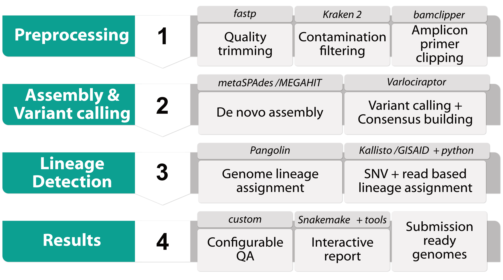

<h1>
Workflow for Transparent and Robust Virus Variant Calling, Genome Reconstruction
 and Lineage Assignment
</h1>

## Workflow Overview

## Highlights

- Using state of the art tools, easily extended for other viruses

- Tool and database updates for critical components via Conda

- Built using modern design patterns with Conda and Snakemake

- Extensible and easy to customize

- Submission Ready Genomes

- Customizable reporting with comprehensive visualization

Four different example elements of the results generated by UnCoVar:

- a: The genome coverage of the aligned reads, visualized for multiple samples

- b: evaluation of known protein alterations from VOCs for one sample

- c: a pileup of reads at the position of one protein alteration. The mutations
 observed for multiple reads (grey bars) for a single sample, here in the S gene

- d: The lineage assignments inferred for single reads for one sample
